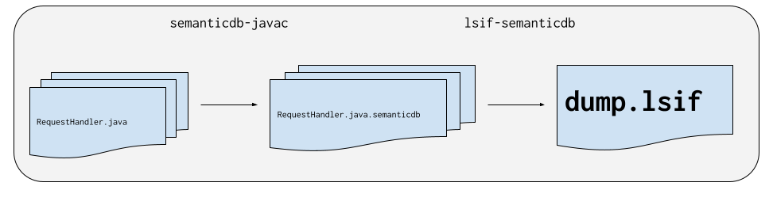

# Java LSIF indexer 

Visit https://lsif.dev/ to learn about LSIF.

## Usage

⚠️ This project is under development so there is nothing to try out at the
moment.

### Supported tools and versions

Currently, only Java 8 with the build tool sbt is supported. We hope to increase
the support as the project evolves.

| Language version | Support |
| ---------------- | ------- |
| Java 7           | ❌      |
| Java 8           | ✅      |
| Java 11+         | ❌      |

| Build tool | Support |
| ---------- | ------- |
| Gradle     | ❌      |
| Maven      | ❌      |
| Bazel      | ❌      |
| sbt        | ✅      |

## Contributing

The following sections provide tips if you want to contribute to this codebase.

### Overview

This project is implemented as a
[Java compiler plugin](https://www.baeldung.com/java-build-compiler-plugin) that
generates one
[SemanticDB](https://scalameta.org/docs/semanticdb/specification.html) file for
each `*.java` source file. After compilation completes, the SemanticDB files are
processed to produce LSIF.

### Why Java compiler plugin?

There are several benefits to implementing lsif-java as a compiler plugin:

- **Simple installation**: most Java build tools support a way to configure
  compiler plugins.
- **Fidelity**: by using Java compiler APIs, we ensure that the produced LSIF
  data is accurate even as new Java versions are released.

### Why SemanticDB?

SemanticDB is Protobuf schema for semantic information such as symbols and types
about programs in Java, Scala and other languages. There are several benefits to
using SemanticDB as an intermediary representation for LSIF:

- **Simplicity**: It's easy to translate a single Java source file into a single
  SemanticDB file. It's more complicated to produce LSIF directly because LSIF
  needs a project-wide context to produce definitions/hovers.
- **Performance**: SemanticDB is fast to write and read. The compiler introduces
  low overhead on compilation and the final conversion to LSIF can be safely
  parallelized.

### Project structure

These are the main components of the project.

- `semanticdb-javac/src/main/java`: the Java compiler plugin that creates
  SemanticDB files.
- `tests/minimized`: minimized Java source files that reproduce interesting test
  cases.
- `tests/unit`: fast running unit tests that are helpful for local edit-and-test
  workflows.
- `tests/snapshots`: slow running
  ["snapshot tests"](https://jestjs.io/docs/en/snapshot-testing) that index a
  corpus of published Java libraries.

### Helpful commands

| Command                                          | Where     | Description                                                                      |
| ------------------------------------------------ | --------- | -------------------------------------------------------------------------------- |
| `./sbt`                                          | terminal  | Start interactive sbt shell with Java 8. Takes a while to load on the first run. |
| `unit/test`                                      | sbt shell | Run fast unit tests. Good for edit-and-test workflows.                           |
| `snapshot/testOnly tests.MinimizedSnapshotSuite` | sbt shell | Runs fast snapshot tests. Indexes a small set of files under `tests/minimized`.  |
| `snapshot/testOnly tests.LibrarySnapshotSuite`   | sbt shell | Runs slow snapshot tests. Indexes a corpus of external Java libraries.           |
| `snapshot/test`                                  | sbt shell | Runs all snapshot tests.                                                         |
| `snapshot/run`                                   | sbt shell | Update snapshot tests. Use this command after you have fixed a bug.              |

### Import the project into IntelliJ

It's recommended to use IntelliJ when editing code in this codebase.

First, install the
[IntelliJ Community Edition](https://www.jetbrains.com/idea/download/). The
community edition is
[open source](https://github.com/JetBrains/intellij-community) and free to use.

Next, install the IntelliJ Scala plugin.

Run "File > Project From Existing Sources" to import the sbt build into
IntelliJ.

### Don't use VS Code/Vim/Sublime Text/Emacs

It's not recommended to use other editors than IntelliJ at the moment. The
reason for this is that IntelliJ is the only IDE that properly supports hybrid
Java/Scala codebases.
